# LiveKit Console

A web console for a self-hosted [LiveKit](https://livekit.io) server — SIP
trunks, dispatch rules, live rooms and egress recordings.

> Not affiliated with, or endorsed by, LiveKit.

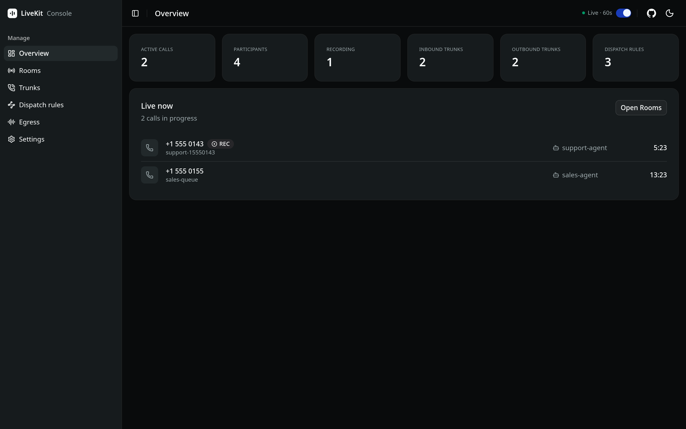

<details>
<summary>More screenshots</summary>

### Rooms
| Live calls | Expanded |
|---|---|
| 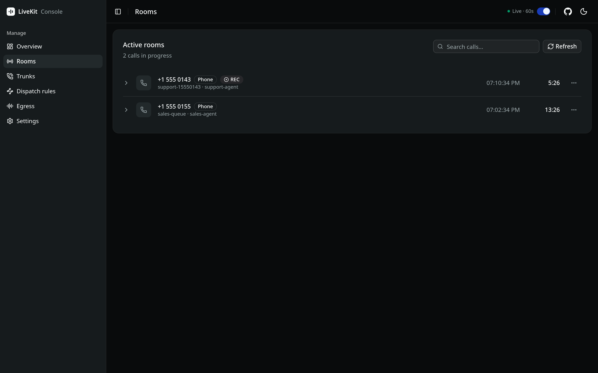 | 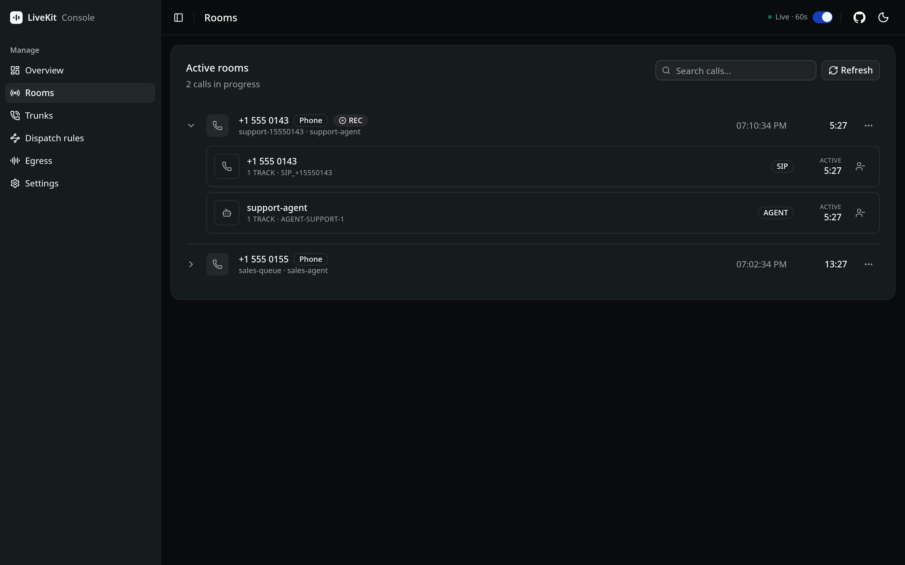 |

### Trunks
| List | Expanded |
|---|---|
| 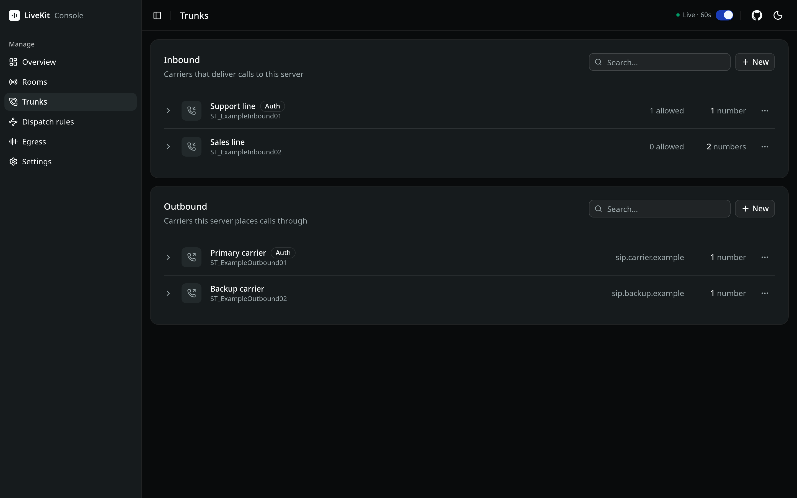 | 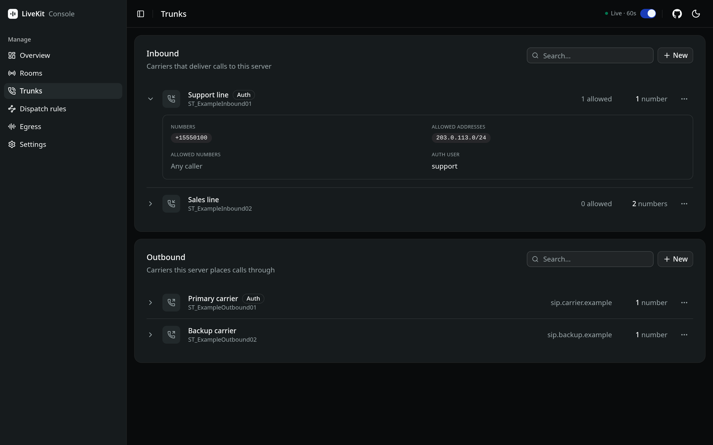 |

| Create — form | Create — JSON |
|---|---|
| 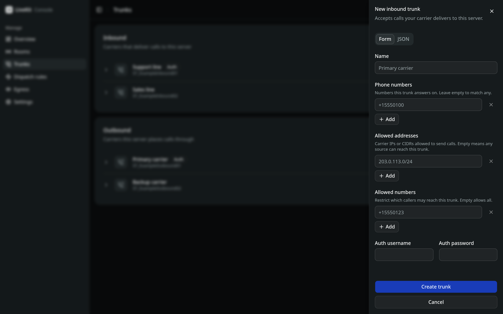 | 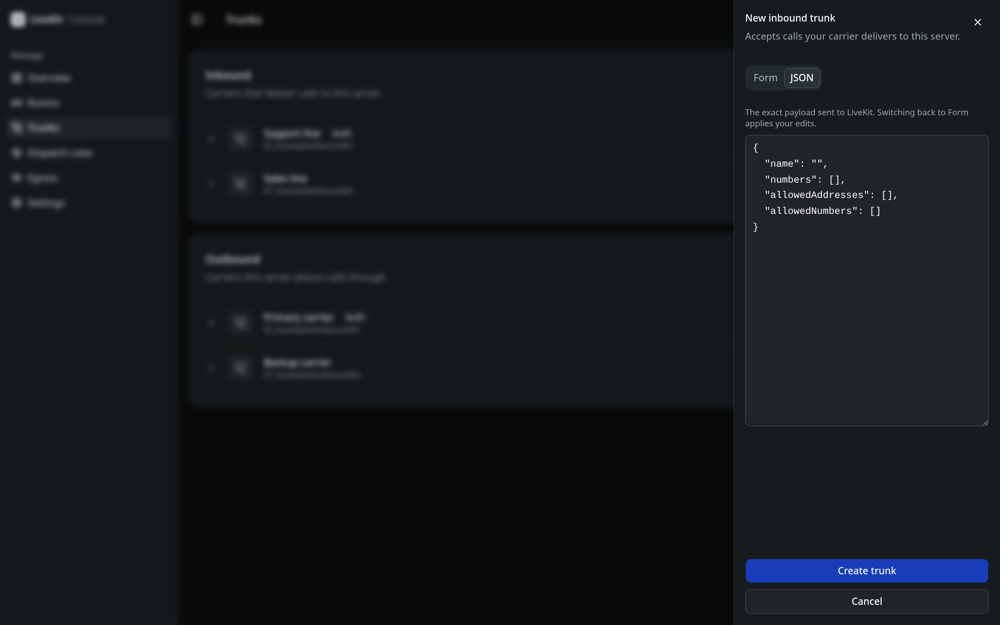 |

### Dispatch rules
| List | Expanded |
|---|---|
| 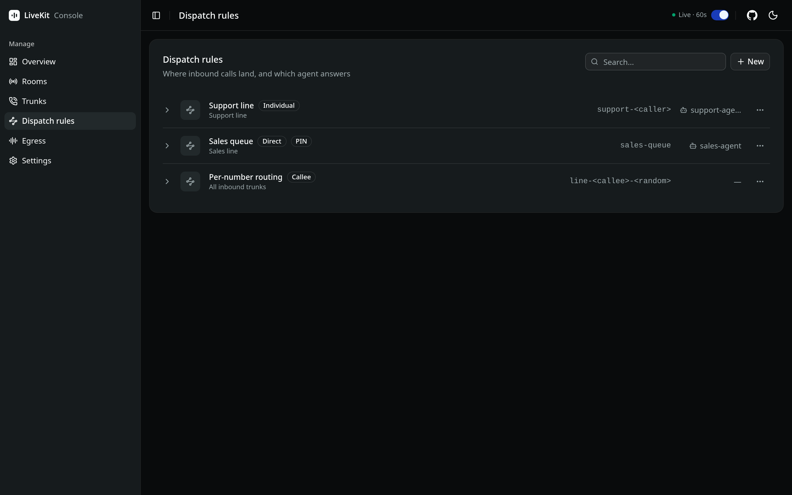 | 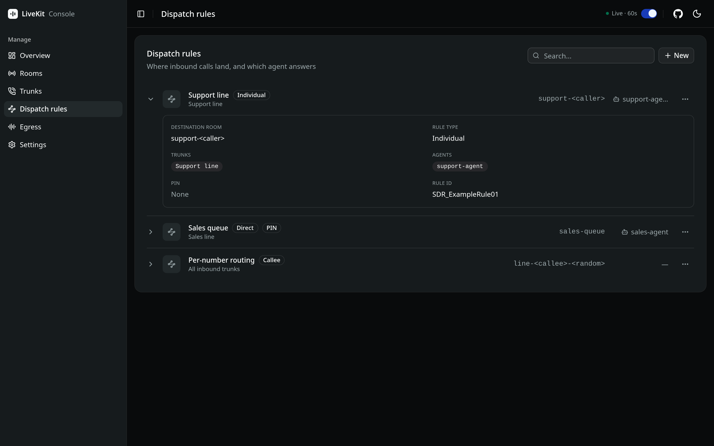 |

| Create — form | Create — JSON |
|---|---|
| 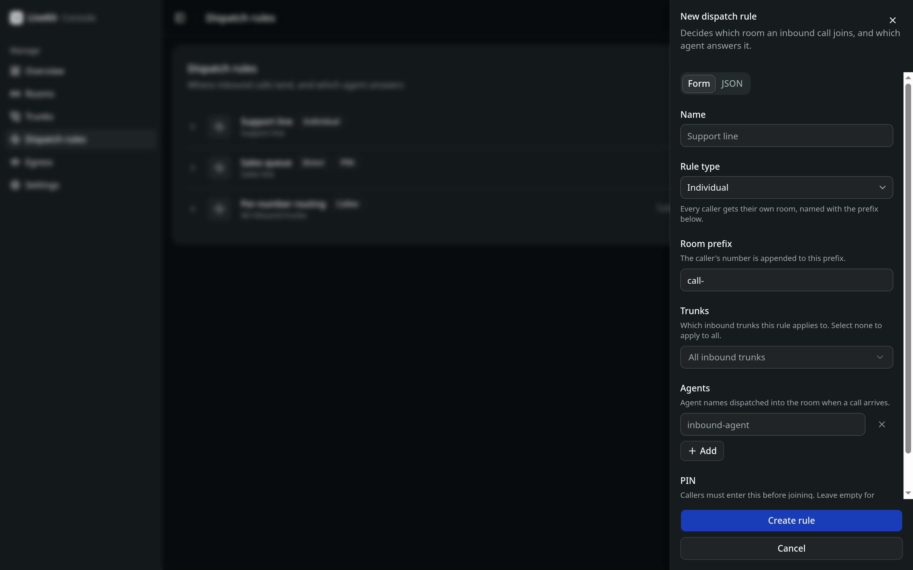 | 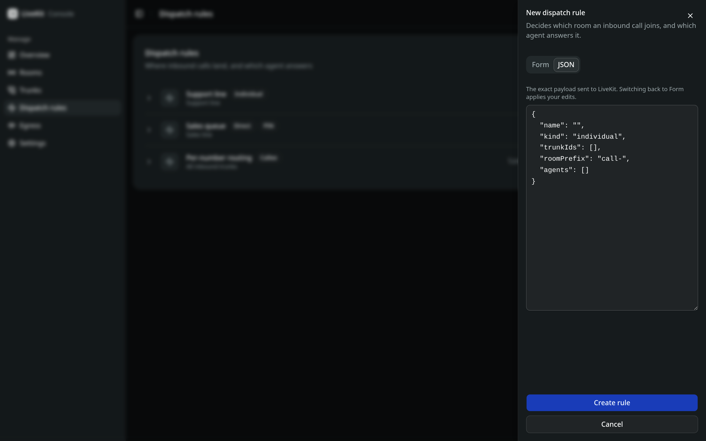 |

### Egress
| Recordings | Expanded |
|---|---|
| 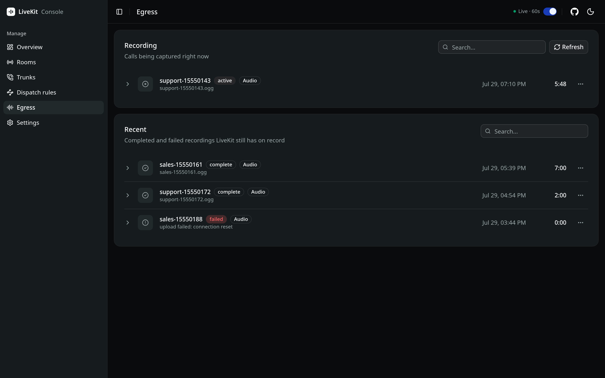 | 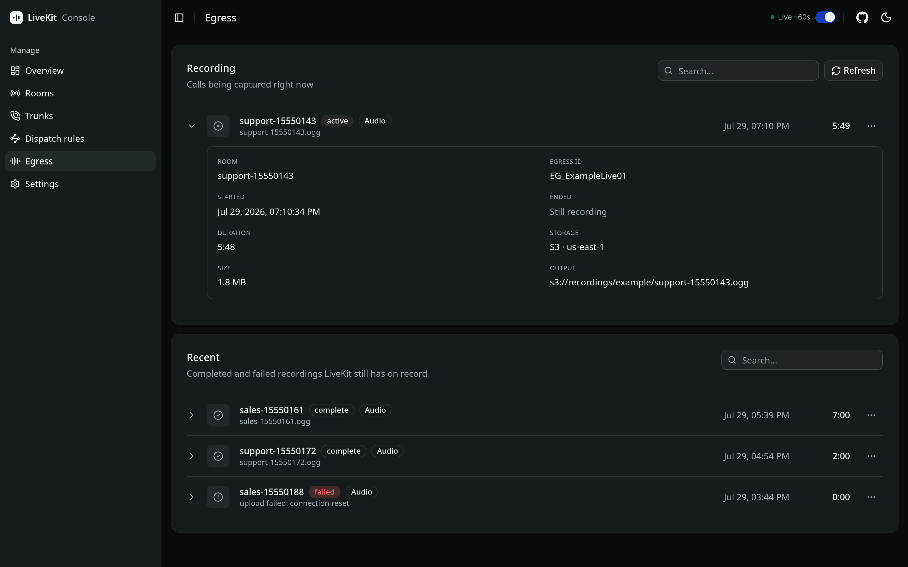 |

### Settings
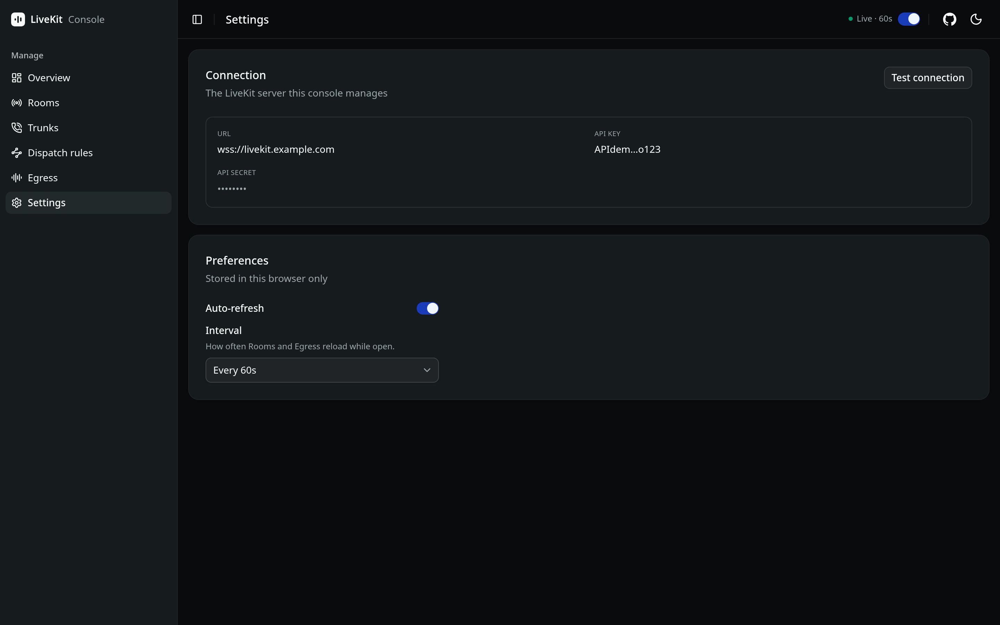

</details>

## Architecture

Two halves, one origin:

- **`backend/`** — FastAPI. A thin, authenticated proxy over the official
  [`livekit-api`](https://pypi.org/project/livekit-api/) SDK. It defines no
  schemas of its own: requests are parsed straight into LiveKit's protobuf
  messages and responses are their canonical JSON, so the console never
  drifts from what the API actually speaks, and new LiveKit fields show up
  without a code change.
- **`frontend/`** — React SPA. Vite, TanStack Router (file-based) and
  TanStack Query, shadcn/ui, react-hook-form. Talks only to `/api` on the
  same origin.

In development Vite proxies `/api` to the backend; in production the backend
serves the built SPA, so the whole thing ships as a single container. No
CORS, and the session cookie just works.

## Development

Backend (Python ≥ 3.13, [uv](https://docs.astral.sh/uv/)):

```bash
cd backend
cp .env.example .env   # fill in
uv run main.py         # http://localhost:8000, docs at /docs
```

Frontend (Node ≥ 22):

```bash
cd frontend
npm install
npm run dev            # http://localhost:5173, /api proxied to :8000
```

## Configuration

All configuration is environment variables, read by the backend from the
environment or `backend/.env`:

| Variable | Required | Notes |
|---|---|---|
| `LIVEKIT_URL` | yes | `wss://…`. Server-side only, never sent to the browser |
| `LIVEKIT_API_KEY` | yes | |
| `LIVEKIT_API_SECRET` | yes | |
| `AUTH_USERNAME` | yes | The backend refuses to start without credentials |
| `AUTH_PASSWORD` | yes | |
| `SESSION_SECRET` | no | Any length. Unset means random per boot, so restarts sign everyone out |
| `SESSION_SECURE` | no | `true` once TLS terminates in front |

Sessions are stateless signed cookies (12 h). There is no revocation before
expiry — changing `AUTH_PASSWORD` does not sign out anyone already in.
Leaving `SESSION_SECRET` unset does end every session on restart.

## Security

- The LiveKit API secret stays server-side. The browser only ever talks to
  this backend; the settings page shows the key masked.
- Authentication is middleware, enforced on every `/api` route by default —
  a new module is protected the moment it is mounted, nobody has to
  remember a guard.
- The session cookie is `httpOnly`, `SameSite=Lax`. Login compares
  credentials in constant time, both fields always.
- Writes are validated against LiveKit's own protobuf schema before they
  reach your server — a bad payload gets a 400 with the exact reason, not a
  corrupted resource.

## Requirements

A LiveKit server and an API key with admin permissions. Works against both
self-hosted LiveKit and LiveKit Cloud.

## Deployment

One container: the image builds the SPA and the backend serves it, so the
app and its API share an origin. Pull the deployment files, fill in `.env`,
and bring it up:

```bash
mkdir livekit-console && cd livekit-console

curl -fsSLO "https://raw.githubusercontent.com/bhagyajitjagdev/livekit-console/main/deploy/{compose.yml,Caddyfile,.env.example}"

cp .env.example .env
$EDITOR .env

docker compose up -d
```

Caddy obtains a certificate for `CONSOLE_DOMAIN` and proxies to the
console, which is never published to the host directly.

Already have a reverse proxy? Run the image on its own:

```bash
docker run -d -p 8000:8000 --env-file .env \
  ghcr.io/bhagyajitjagdev/livekit-console:latest
```

Images are published to GHCR by the release workflow on every `v*` tag.

## Licence

MIT — see [LICENSE](LICENSE). Third-party licences and trademark notices
are in [NOTICE](NOTICE).
